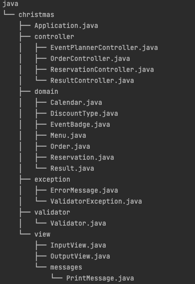

# 미션 - 크리스마스 프로모션 🎄

## ✅ 기능 목록

### 1. 게임 시작

- [X] 식당 예상 방문 날짜를 입력 받는다.
    - [X] 방문할 날짜는 1 이상 31 이하의 숫자만 입력 받는다.
    - [X] 잘못된 값을 입력한 경우 예외 처리한다.

- [X] 고객에게 안내할 이벤트 주의 사항을 출력한다.

- [X] 주문할 메뉴와 개수를 입력 받는다.
    - [X] 메뉴판에 없는 메뉴를 입력 시 예외 처리한다.
    - [X] 메뉴의 개수는 1 이상의 숫자가 아닐 경우 예외 처리한다.
    - [X] 메뉴는 한 번에 최대 20개까지만 주문할 수 있다.
    - [X] 음료만 주문 시, 주문할 수 없다.
    - [X] 중복 메뉴를 입력한 경우 예외 처리한다.
    - [X] 총 주문 금액 10,000원 이상이 아닐 경우 이벤트를 적용하지 않는다.

### 2. 게임 진행

- [X] 예상 방문 날짜, 메뉴, 개수를 계산하고 다음 이벤트를 검사한다.
    - [X] 크리스마스 디데이 할인
    - [X] 평일 할인(일요일~목요일)
    - [X] 주말 할인(금요일, 토요일)
    - [X] 특별 할인
    - [X] 증정 이벤트
    - [X] 이벤트 기간

- [X] 혜택 금액에 따른 이벤트 배지 부여
    - [X] 5천 원 이상: 별
    - [X] 1만 원 이상: 트리
    - [X] 2만 원 이상: 산타

### 3. 게임 종료

- [X] 식당에 방문할 날짜와 메뉴를 미리 선택하면 이벤트 플래너가 아래의 항목들을 출력한다.
    - [X] 주문 메뉴
        - [X] 주문 메뉴의 출력 순서는 자유롭게 출력한다.
    - [X] 할인 전 총주문 금액
    - [X] 증정 메뉴
        - [X] 증정 이벤트에 해당하지 않는 경우, 증정 메뉴 “없음”으로 출력한다.
    - [X] 혜택 내역
        - [X] 고객에게 적용된 이벤트 내역만 출력한다.
        - [X] 적용된 이벤트가 하나도 없다면 혜택 내역 “없음”으로 출력한다.
        - [X] 여러 개의 이벤트가 적용된 경우, 출력 순서는 자유롭게 출력한다.
    - [X] 총혜택 금액
        - [X] 총혜택 금액에 따른 이벤트 배지의 이름을 다르게 출력한다.
        - [X] 총혜택 금액 = 할인 금액의 합계 + 증정 메뉴의 가격
    - [X] 할인 후 예상 결제 금액
        - [X] 할인 후 예상 결제 금액 = 할인 전 총주문 금액 - 할인 금액
        - [X] 증정 이벤트에 포함된 금액은 할인 후 예상 결제 금액에 포함시키지 않는다.
    - [X] 12월 이벤트 배지 내용
        - [X] 이벤트 배지가 부여되지 않는 경우, “없음”으로 출력한다.

### 4. 예외

- 사용자가 잘못된 값을 입력할 경우 `IllegalArgumentException`를 발생시키고, "[ERROR]"로 시작하는 에러 메시지를 출력 후 **그 부분부터 입력을 다시 받는다.**
    - `Exception`이 아닌 `IllegalArgumentException`, `IllegalStateException` 등과 같은 명확한 유형을 처리한다.
    - 예외 상황 시 에러 문구를 출력해야 한다. 단, 에러 문구는 "[ERROR]"로 시작해야 한다.

### 5. 목표 (피드백)

- 클래스(객체)를 분리한다.
- 도메인 로직에 대한 단위 테스트를 작성한다.
- 발생할 수 있는 예외 상황에 대해 고민한다.
- 비즈니스 로직과 UI 로직을 분리한다.
- 연관성이 있는 상수는 static final 대신 enum을 활용한다.
- final 키워드를 사용해 값의 변경을 막는다.
- 객체의 상태 접근을 제한한다.
- 객체는 객체스럽게 사용한다.
- 필드(인스턴스 변수)의 수를 줄이기 위해 노력한다.
- 성공하는 케이스 뿐만 아니라 예외에 대한 케이스도 테스트한다.
- 테스트 코드도 코드이므로 리팩터링을 통해 개선해 나간다.
- 테스트를 위한 코드는 구현 코드에서 분리되어야 한다. 아래의 예시처럼 테스트를 통과하기 위해 구현 코드를 변경하거나 테스트에서만 사용되는 로직을 만들지 않는다.
    - 테스트를 위해 접근 제어자를 바꾸는 경우
    - 테스트 코드에서만 사용되는 메서드
- 단위 테스트하기 어려운 코드를 단위 테스트하깅
- private 함수를 테스트 하고 싶다면 클래스(객체) 분리를 고려한다.
### 6. 3주 차 미션(로또 게임 🍀) 코드 리뷰를 통해 개선할 점

- 지난 미션에서 개선할 필요가 있는 리뷰를 정리하여 이번 미션에서 고민하며 개선하려고 노력했습니다.

<table>
    <tr>
        <th align="center">Type</th>
        <th align="center">Review</th>
        <th align="center">Reviewer</th>
    </tr>
    <tr><td colspan="3"></td></tr>
    <tr>
        <td rowspan="15"><b>✏️&nbsp;코드 리뷰</b></td>
        <td>01. 필요한 로직에만 예외 처리를 하도록 하자.</td>
        <td><b>@wns312</b></td>
    </tr>
      <tr>
        <td>02. 클래스가 너무 많은 상수를 가지면 가독성이 떨어지기 때문에 별도의 클래스나 enum으로 분리해보자.</td>
        <td><b>@gywns0417</b></td>
    </tr>
      <tr>
        <td>03. 한 메서드가 하나의 역할을 가지도록 별도의 클래스나 메서드로 책임을 분리하자.</td>
        <td><b>@gywns0417</b></td>
    </tr>
      <tr>
        <td>04. 변경될 수 있는 정보는 상수나 enum으로 관리하고, 해당 메시지에서 값들을 참조하는 방향으로 개선하자.</td>
        <td><b>@gywns0417</b></td>
    </tr>
      <tr>
        <td>05. View가 Model에 너무 의존하게 하지 말고, 온전히 View의 역할만 하게 하도록 고려하자.</td>
        <td><b>@twkwon0417 @youngsu5582</b></td>
    </tr>
      <tr>
        <td>06. [ERROR]에 해당하는 prefix 부분은 상수로 선언하고, getMessage() 할 때 PREFIX + message 하는 식으로 사용해보자.</td>
        <td><b>@youngsu5582</b></td>
    </tr>
      <tr>
        <td>07. 변경 가능성이 있는 변수에 대해서 확장성에 대해 좀 더 고민해 보자.</td>
        <td><b>@youngsu5582 @OiKimiO</b></td>
    </tr>
    <tr>
        <td>08. 오류 발생시 해당 부분에서 다시 입력 받을 수 있도록 신경쓰자.</td>
        <td><b>@guswlsdl0121</b></td>
    </tr>
    <tr>
        <td>09. 정적 메서드를 활용하여 객체 의존성을 줄여보자.</td>
        <td><b>@OiKimiO</b></td>
    </tr>
    <tr>
        <td>10. String matches를 메서드 내부에서 사용하는 것 보다는 Pattern.matches를 static final로 관리하는 것이 성능상 이점이 있으니 활용해보자.</td>
        <td><b>@OiKimiO</b></td>
    </tr>
    <tr>
        <td>11. 포메팅을 활용하여 처리해보자.</td>
        <td><b>@Seol-JY</b></td>
    </tr>
    <tr>
        <td>12. stream을 활용하면 중복을 제거할 때 결과값을 바로 받을 수 있다.</td>
        <td><b>@YejiGong</b></td>
    </tr>
    <tr>
        <td>13. 매직 넘버를 상수로 선언하는 것은 좋으나 ZERO나 FIVE같은 직접적인 변수명 보다는 해당 값의 의미를 알려주는 변수명으로 지어보자.</td>
        <td><b>@YejiGong</b></td>
    </tr>
</table>

### 7. 패키지 구조
- 아래 테이블 형식은 <b>@h-beeen</b>님의 README를 참고했습니다.
## 📦&nbsp;&nbsp;패키지 구조

[//]: # (&nbsp;&nbsp;FinalResponse</b>)

<table>
    <tr>
        <th align="center">Package</th>
        <th align="center">Class</th>
        <th align="center">Description</th>
    </tr>
    <tr>
        <td rowspan="4"><b>&nbsp;&nbsp;controller</b></td>
        <td><b>&nbsp;&nbsp;EventPlannerController</b></td>
        <td>이벤트 플래너 로직을 메인으로 동작하는 컨트롤러</td>
    </tr>
    <tr>
        <td><b>&nbsp;&nbsp;OrderController</b></td>
        <td>주문을 받는 로직을 동작하는 컨트롤러</td>
    </tr>
    <tr>
        <td><b>&nbsp;&nbsp;ReservationController</b></td>
        <td>방문 날짜 예약을 받는 로직을 동작하는 컨트롤러</td>
    </tr>
    <tr>
        <td><b>&nbsp;&nbsp;ResultController</b></td>
        <td>방문 날짜와 주문을 토대로 결과를 출력하기 위한 로직을 동작하는 컨트롤러</td>
    </tr>
    <tr><td colspan="3"></td></tr>
    <tr>
        <td rowspan="7">&nbsp;&nbsp;<b>domain </b></td>
        <td><b>&nbsp;&nbsp;Calendar</b></td>
        <td>12월 달력에 대한 정보를 갖는 enum 클래스</td>
    </tr>
    <tr>
        <td><b>&nbsp;&nbsp;DiscountType</b></td>
        <td>할인 이벤트에 대한 정보를 갖는 enum 클래스</td>
    </tr>
    <tr>
        <td><b>&nbsp;&nbsp;EventBadge</b></td>
        <td>이벤트 배지 부여에 대한 정보를 갖는 enum 클래스</td>
    </tr>
    <tr>
        <td><b>&nbsp;&nbsp;Menu</b></td>
        <td>주문 메뉴에 대한 정보를 갖는 enum 클래스</td>
    </tr>
    <tr>
        <td><b>&nbsp;&nbsp;Order</b></td>
        <td>주문에 대한 정보를 갖는 클래스</td>
    </tr>
    <tr>
        <td><b>&nbsp;&nbsp;Reservation</b></td>
        <td>예약 날짜에 대한 정보를 갖는 클래스</td>
    </tr>
    <tr>
        <td><b>&nbsp;&nbsp;Result</b></td>
        <td>이벤트 결과에 대한 정보를 갖는 클래스</td>
    </tr>
    <tr><td colspan="3"></td></tr>
    <tr>
        <td rowspan="2">&nbsp;&nbsp;<b>exception</b></td>
        <td><b>&nbsp;&nbsp;ErrorMessage</b></td>
        <td>에러 메시지에 대한 정보를 갖는 enum 클래스</td>
    </tr>
    <tr>
        <td><b>&nbsp;&nbsp;ValidatorException</b></td>
        <td>에러 메시지를 관리하는 클래스</td>
    </tr>
    <tr><td colspan="3"></td></tr>
    <tr>
        <td rowspan="1">&nbsp;&nbsp;<b>validator</b></td>
        <td><b>&nbsp;&nbsp;Validator</b></td>
        <td>전반적인 검증에 대한 관리를 하는 클래스</td>
    </tr>
    <tr><td colspan="3"></td></tr>
    <tr>
        <td rowspan="3">&nbsp;&nbsp;<b>view</b></td>
        <td><b>&nbsp;&nbsp;PrintMessage</b></td>
        <td>입출력에 관한 메시지 상수에 대한 정보를 갖는 enum 클래스</td>
    </tr>
    <tr>
        <td><b>&nbsp;&nbsp;InputView</b></td>
        <td>입력을 담당하는 View 클래스</td>
    </tr>
    <tr>
        <td><b>&nbsp;&nbsp;OutputView</b></td>
        <td>출력을 담당하는 View 클래스</td>
    </tr>
    
</table>

